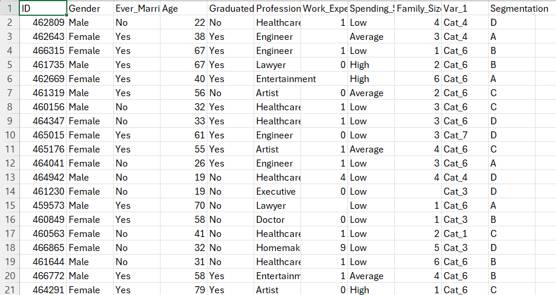

# Developing a Neural Network Classification Model

## AIM

To develop a neural network classification model for the given dataset.

## Problem Statement

An automobile company has plans to enter new markets with their existing products. After intensive market research, they’ve decided that the behavior of the new market is similar to their existing market.

In their existing market, the sales team has classified all customers into 4 segments (A, B, C, D ). Then, they performed segmented outreach and communication for a different segment of customers. This strategy has work exceptionally well for them. They plan to use the same strategy for the new markets.

You are required to help the manager to predict the right group of the new customers.

## Neural Network Model

Include the neural network model diagram.

## DESIGN STEPS

### STEP 1:
Load and preprocess the dataset (handle missing values, encode categorical features, scale numeric data).

### STEP 2:
Split the dataset into training and testing sets, convert to tensors, and create DataLoader objects

### STEP 3:
Build the neural network model, train it with CrossEntropyLoss and Adam optimizer, then evaluate with confusion matrix and classification report.


## PROGRAM

### Name: HARISHKUMAR R
### Register Number: 212223230073
```py
class NeuralNetwork(torch.nn.Module):
    def __init__(self, size):
        super().__init__()
        self.fc1 = torch.nn.Linear(size, 32)
        self.fc2 = torch.nn.Linear(32, 16)
        self.fc3 = torch.nn.Linear(16, 4)
        self.relu = torch.nn.ReLU()

    def forward(self, x):
        x = self.relu(self.fc1(x))
        x = self.relu(self.fc2(x))
        x = self.fc3(x)
        return x

# Initialize the Model, Loss Function, and Optimizer
model=NeuralNetwork(x_train.shape[1])
loss_fn=torch.nn.CrossEntropyLoss()
optimizer=torch.optim.Adam(model.parameters(),lr=0.001)


def train_model(model, train_loader, criterion, optimizer, epochs=100):
    for epoch in range(epochs):
        model.train()
        for X_batch, y_batch in train_loader:
            optimizer.zero_grad()
            outputs = model(X_batch)
            loss = criterion(outputs, y_batch)
            loss.backward()
            optimizer.step()

        if (epoch+1) % 10 == 0:
            print(f"Epoch [{epoch+1}/{epochs}], Loss: {loss.item():.4f}")
```

## Dataset Information


## OUTPUT


### Confusion Matrix


### Classification Report


### New Sample Data Prediction

## RESULT
The neural network model was successfully built and trained to handle classification tasks.